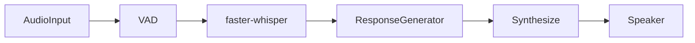

# speech-to-speech-core 🎙️➡️🧠➡️🔊

Local-first speech-to-speech prototype with modular audio capture, VAD, transcription, response generation, and playback.

## Badges

[](https://www.python.org/)
[](LICENSE)
[](https://github.com/fusselc/speech-to-speech-core/actions/workflows/ci.yml)
[](https://github.com/fusselc/speech-to-speech-core/stargazers)

## Quick Start ⚡

### 1) Setup

```bash
git clone https://github.com/fusselc/speech-to-speech-core.git
cd speech-to-speech-core
uv venv
source .venv/bin/activate  # Windows: .venv\Scripts\activate
uv sync --group dev
```

### 2) Run with the CLI

```bash
speech-to-speech run --model small --device auto --streaming --loop
```

### 3) Backward-compatible entry points

```bash
python src/app.py
python -m src.app
```

## CLI Reference 🧭

```bash
speech-to-speech run [OPTIONS]
```

| Flag | Type | Default | Description |
| --- | --- | --- | --- |
| `--model`, `-m` | `str` | `base` | faster-whisper model size (`tiny`, `base`, `small`, `medium`, `large`) |
| `--device`, `-d` | `auto \| cpu \| cuda` | `auto` | Preferred transcription device |
| `--streaming/--no-streaming` | `bool` | `--streaming` | Enable/disable streaming-oriented chunk capture |
| `--loop/--no-loop` | `bool` | `--loop` | Continue listening after each response |
| `--vad-sensitivity` | `float` | `0.5` | Silero VAD speech confidence threshold |
| `--debug/--no-debug` | `bool` | `--no-debug` | Enable debug-level logs |

Examples:

```bash
# Single turn, CPU only
speech-to-speech run --no-loop --device cpu

# Faster model startup and low latency on capable GPU
speech-to-speech run --model small --device cuda --streaming --loop

# More permissive speech detection
speech-to-speech run --vad-sensitivity 0.35
```

## Configuration ⚙️

All tunable values live in `/home/runner/work/speech-to-speech-core/speech-to-speech-core/src/config.py`.

| Setting | Default | Description |
| --- | --- | --- |
| `SAMPLE_RATE` | `16000` | Microphone sampling rate in Hz |
| `CHANNELS` | `1` | Mono capture channel count |
| `RECORD_DURATION` | `5.0` | Max recording duration per turn (seconds) |
| `USE_STREAMING` | `True` | Toggle streaming-style chunk capture |
| `STREAMING_CHUNK_DURATION` | `0.5` | Chunk length in streaming mode (seconds) |
| `VAD_CHUNK_SECONDS` | `0.5` | Silero VAD chunk duration baseline (seconds) |
| `SILENCE_THRESHOLD` | `0.5` | VAD speech threshold (`0.0`–`1.0`) |
| `VAD_SILENCE_SECONDS` | `1.0` | Required trailing silence before finalize |
| `VAD_MIN_VOICE_CHUNKS` | `1` | Minimum voice chunks before silence stop can trigger |
| `WHISPER_MODEL` | `"base"` | faster-whisper model size |
| `WHISPER_DEVICE` | `"auto"` | Device preference (`auto`, `cpu`, `cuda`) |
| `LANGUAGE` | `None` | Optional language hint for transcription |
| `TTS_RATE` | `180` | pyttsx3 speaking rate |
| `TTS_ENGINE` | `"pyttsx3"` | Future-facing TTS backend selector |
| `LOOP_MODE` | `True` | Repeat turns continuously |
| `MAX_TURNS` | `0` | Loop limit (`0` means unlimited) |

## Architecture 🏗️



Modules are intentionally isolated for easy swapping:
- `audio_input.py`
- `transcribe.py`
- `responder.py`
- `synthesize.py`
- `app.py`

## Expected Latency ⏱️

Latency depends on model size, device, and microphone environment.

Typical short-utterance ranges:

| Stage | CPU (small model) | CUDA (small model) |
| --- | --- | --- |
| Recording + VAD stop | 0.8s–5.0s | 0.8s–5.0s |
| Save WAV | 1–10 ms | 1–10 ms |
| Transcription | 800–3000 ms | 200–1200 ms |
| Response generation (echo) | <5 ms | <5 ms |
| TTS synthesis/playback start | 50–300 ms | 50–300 ms |

Tip: `--streaming` + smaller models usually produces the best perceived responsiveness.

## Hardware Recommendations 💻

| Profile | Recommended Hardware | Notes |
| --- | --- | --- |
| Lightweight dev | 4-core CPU, 8 GB RAM | Use `tiny`/`base`, CPU mode |
| Balanced local app | 6–8 core CPU, 16 GB RAM | `base`/`small`, optional GPU |
| Low-latency power user | NVIDIA GPU (8 GB+ VRAM), 16–32 GB RAM | `small`/`medium` with CUDA |
| Heavier experimentation | NVIDIA GPU (12 GB+ VRAM), 32 GB RAM | Better for larger models and future LLM responder |

## How to Swap Components 🔌

The pipeline is designed for drop-in replacements:

1. **Swap TTS backend (`synthesize.py`)**
   - Keep `speak_text(text: str) -> None` and `save_speech(text: str) -> str`.
   - Next recommended upgrade: **Piper TTS** or **XTTS-v2**.
   - OpenVoice integration points are already documented in the module.

2. **Swap response generator (`responder.py`)**
   - Keep `ResponseGenerator` protocol and inject alternate backend.
   - Replace deterministic echo with an LLM adapter while preserving interface.

3. **Swap transcription (`transcribe.py`)**
   - Keep `transcribe_file(file_path: str) -> str`.
   - Preserve graceful fallback and error handling behavior.

4. **Adjust runtime behavior (`config.py` + CLI)**
   - Keep default values stable for backward compatibility.
   - Add new flags in `src/cli.py` before plumbing into runtime.

## Future Roadmap 🚀

- Full streaming transcripts
- Interrupt handling (barge-in)
- Voice cloning workflows
- Web UI for local/remote control

## Benchmarks 📊

Run a simple 10-turn latency benchmark:

```bash
python -m benchmarks.run_latency_benchmark
```

Optional turn override:

```bash
python -m benchmarks.run_latency_benchmark --turns 10
```

Results are written to:

`/home/runner/work/speech-to-speech-core/speech-to-speech-core/benchmarks/latency_results.csv`

## Troubleshooting 🛠️

- Verify microphone permissions if recording fails.
- Install `espeak` on Linux if pyttsx3 cannot speak.
- First faster-whisper run needs network access to download model assets.
- If CUDA OOM appears, switch to smaller models or `--device cpu`.
- If VAD ends turns too early/late, tune `--vad-sensitivity`.

## Contributing 🤝

1. Create a virtual environment and install dev dependencies.
2. Run validation before opening a PR:

```bash
ruff check .
black --check .
isort --check-only .
mypy src tests
pyright
pytest tests/
pre-commit run --all-files
```

3. Keep modules small, interfaces stable, and docs/tests updated with behavior changes.
